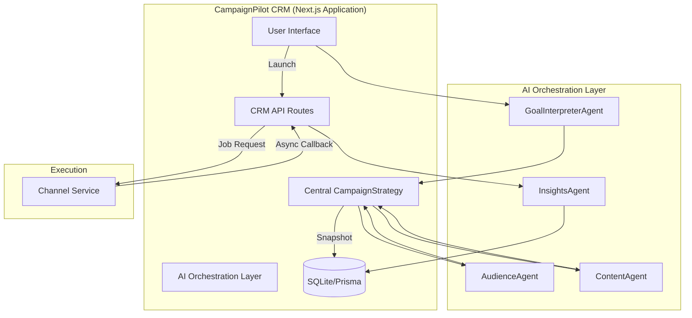

# CampaignPilot Architecture: AI-Native Campaign Orchestrator

## 1. System Overview

CampaignPilot is an AI-native customer engagement platform. It operates as an **Orchestrator** that leverages a central **CampaignStrategy** object shared across specialized agents to interpret business goals, snapshot audiences, and manage campaign lifecycles.

### System Diagram



---

## 2. Central CampaignStrategy & Agent Logic

All agents interact with a central `CampaignStrategy` object. Every agent response is structured to provide both the payload (`output`) and the "why" (`reasoning`) to power the UI's Neural Engine.

### Agent Interface
```typescript
interface AgentResponse<T> {
  output: T;
  reasoning: string; // Used for AI Reasoning Engine UI
}

interface CampaignStrategy {
  id: string;
  goal: {
    objective: string;
    kpis: string[];
    reasoning: string;
  };
  audience: {
    segmentIds: string[];
    count: number;
    reasoning: string;
  };
  content: {
    templates: Record<string, any>;
    reasoning: string;
  };
}
```

---

## 3. Database Schema (Prisma)

### Key Addition: SegmentSnapshot
To ensure auditability, every launched campaign references a `SegmentSnapshot` rather than a live segment.

```prisma
model Campaign {
  id                String           @id @default(uuid())
  title             String
  status            String
  strategy          Json             // Stores the full CampaignStrategy (output + reasoning)
  snapshotId        String
  snapshot          SegmentSnapshot  @relation(fields: [snapshotId], references: [id])
  metrics           CampaignMetrics?
  deliveries        DeliveryLog[]
}

model SegmentSnapshot {
  id          String   @id @default(uuid())
  customerIds String   // Compressed ID list or criteria
  count       Int
  createdAt   DateTime @default(now())
  campaigns   Campaign[]
}
```

---

## 4. API & Callback Lifecycle

1.  **Orchestration**: `GoalInterpreter` -> `Audience` -> `Content` agents populate the `CampaignStrategy`.
2.  **Persistence**: Final strategy and a `SegmentSnapshot` are saved to the DB.
3.  **Handoff**: CRM sends the snapshot and content to the `Channel Service`.
4.  **Feedback**: `Channel Service` provides real-time event callbacks via webhooks.
